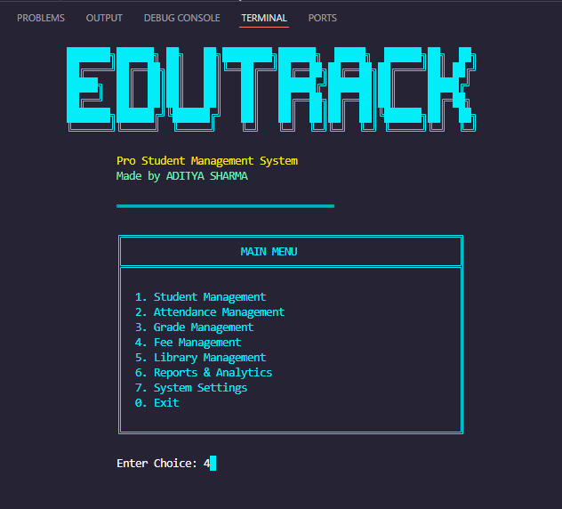
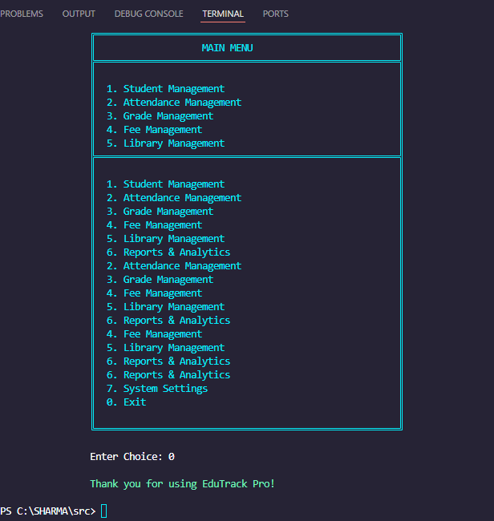
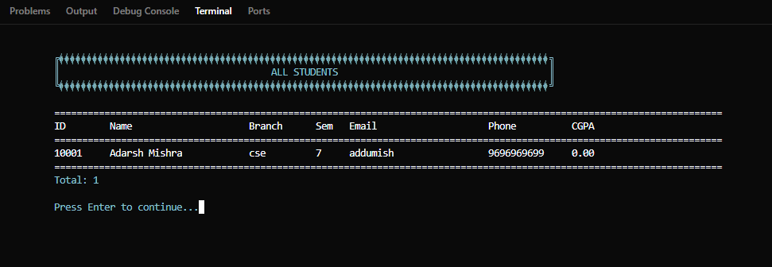

# 🎓 EduTrack Pro: Complete Student Management System

[](https://isocpp.org/)
[](https://github.com)
[](LICENSE)

> **EduTrack Pro** is a comprehensive, feature-rich Student Management System built entirely in **C++** to demonstrate mastery of advanced **Data Structures and Algorithms**. It is an ideal, enterprise-level project for Summer Training or Internship submissions.

---

## ✨ Project Overview

**EduTrack Pro** is designed to digitize and automate core academic and administrative processes for educational institutions. The project focuses on robust data management, efficient operations, and powerful analytics by implementing key computer science concepts:

* **📚 Data Structures:**
    * **Hash Tables:** Used for **O(1) average-time** student lookup and management.
    * **Binary Search Trees (BST):** Implemented for efficient **O(log n) search/insert** operations in the Library Management Module.
    * **Linked Lists:** Utilized for dynamic data storage, such as attendance records and payment histories.
* **💻 Advanced C++ Concepts:**
    * **Pointers:** Extensive use of Single, Double, Function, and Structure Pointers.
    * **File I/O:** Robust data persistence using file handling.
    * **Algorithms:** Implementation of custom Sorting, Searching, and Analytical algorithms (e.g., CGPA/SGPA calculation, Rank Generation).

---

## 🚀 Demo & Visuals

Here are a few glimpses of the EduTrack Pro system in action, showcasing its modular design and core functionalities:

### 1. Home and Main Menu Interface
The main menu provides quick access to all six modules through a clean, console-based user interface.

<p align="center">
  
</p>

### 2. Feature Showcase: Attendance Management
A look at the subject-wise and date-wise attendance tracking feature, which uses Linked Lists for record keeping.

<p align="center">
 
</p>

### 3. Student Example: Grade Report
Demonstrating the result generation and analytics capability, including automatic SGPA/CGPA computation.

<p align="center">
  
</p>

---

## ⚡ Core Features

EduTrack Pro integrates **six robust modules** to manage all institutional data seamlessly.

| Module | Key Functionality | Data Structure/Algorithm Highlight |
| :--- | :--- | :--- |
| **1. 👥 Student Management** | Full CRUD operations, Profile Tracking, Branch/Semester filtering. | **Hash Table** for lightning-fast student ID search. |
| **2. 📊 Attendance Management** | Subject-wise and date-wise tracking, Defaulter list generation. | Dynamic **Linked Lists** for efficient record keeping. |
| **3. 📚 Grade Management** | Internal/External assessment tracking, Automatic Letter Grade/CGPA calculation. | Custom **Analytical Algorithms** for accurate result generation. |
| **4. 💰 Fee Management** | Fee structure setup, Payment tracking, Receipt generation, Defaulter lists. | **File I/O** for persistent financial records. |
| **5. 📖 Library Management** | Book issue/return, Fine calculation, Availability tracking. | **Binary Search Tree (BST)** for efficient book lookup and management. |
| **6. 📈 Reports & Analytics** | Generate Student Performance Reports, Library Usage Stats, Export to CSV. | **Sorting Algorithms** for Rank and Merit List generation. |

---

## 🛠️ Technical Details

### Language & Compiler
* **Primary Language**: C++ (C++11 or higher standard)
* **Compiler**: GCC/G++ (MinGW on Windows)
* **IDE**: Visual Studio Code
* **Target OS**: Cross-platform (Windows, Linux, macOS)

### Focus on Pointers
The project serves as a strong demonstration of C++ memory management and data manipulation through various pointer types:
* **Single & Structure Pointers** (General data handling)
* **Pointer Arrays & Double Pointers** (Implementing the Hash Table)
* **Linked List & Tree Pointers** (Implementing the Linked List and BST nodes)
* **Function Pointers** (For indirect function calls/callbacks - if applicable)

---

## 🚀 Installation & Setup

### Prerequisites
* C++ Compiler (GCC 7.0+ recommended)
* A Terminal or Command Prompt.

### Step-by-Step Guide

1.  **Clone the Repository**
    ```bash
    git clone [https://github.com/yourusername/edutrack-pro.git](https://github.com/yourusername/edutrack-pro.git)
    cd edutrack-pro
    ```

2.  **Compile the Source Code**
    * The project uses a monolithic structure for simplicity (`COMPLETE_MAIN.cpp`).
    
    ```bash
    # For Windows (MinGW)
    g++ -o edutrack.exe COMPLETE_MAIN.cpp -std=c++11
    ```

3.  **Run the Application**
    ```bash
    # Windows
    edutrack.exe
    ```

---
## 📁 Project Structure

```
EduTrack-Pro/
│
├── src/
│   ├── main.cpp                    
│   ├── structures.h                                 
│   ├── student.cpp                
│   ├── attendance.cpp             
│   ├── grades.cpp                  
│   ├── fees.cpp                   
│   ├── library.cpp                 
│   ├── reports.cpp                 
│   └── utils.cpp                   
├── README.md                        
├── Makefile                        
└── LICENSE                        
```
---
---

## 💡 Usage Guide

### Getting Started

1.  Upon running, you will be presented with the main menu.
2.  **Initial Setup:** Navigate to **Student Management** to add the first batch of students.
3.  **Library Setup:** Navigate to **Library Management** to populate the book catalog.
4.  Data is automatically persisted to files upon exit.

### Admin Features
* All modules have comprehensive CRUD operations.
* Data is automatically saved across sessions.
* Reports can be exported for external use.
* Statistics and analytics are computed in real-time.

---

## 📝 License

This project is created primarily for **Educational Purposes** to showcase proficiency in C++ and Data Structures.

---

## Acknowledgements
* **Guide:** Sujeet Sahani
* **Department:** Computer Science & Engineering
